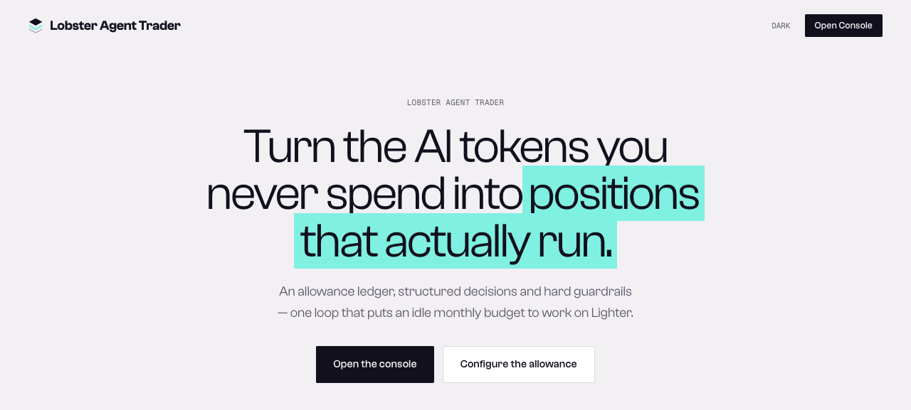
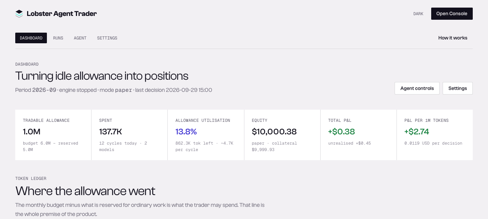
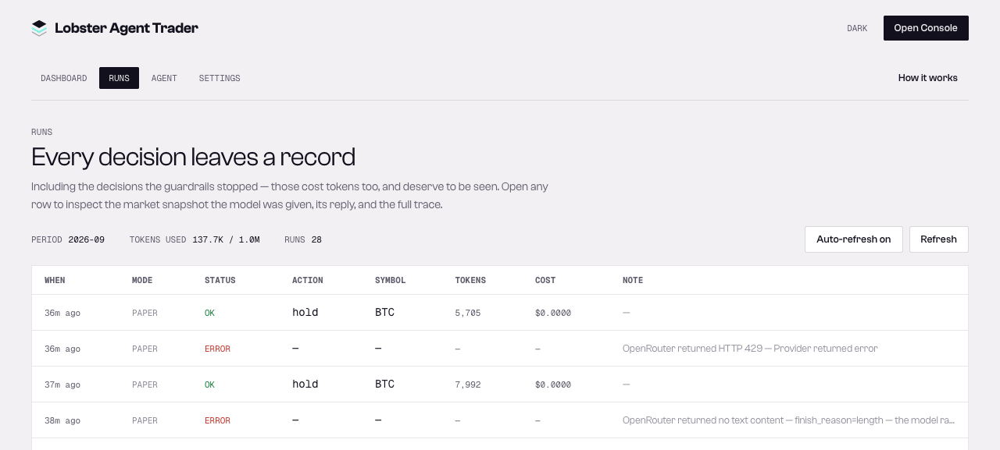
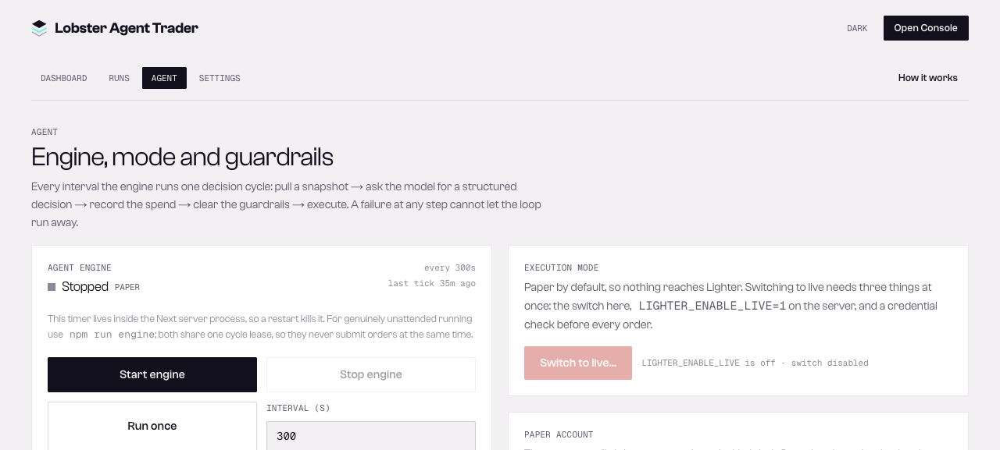
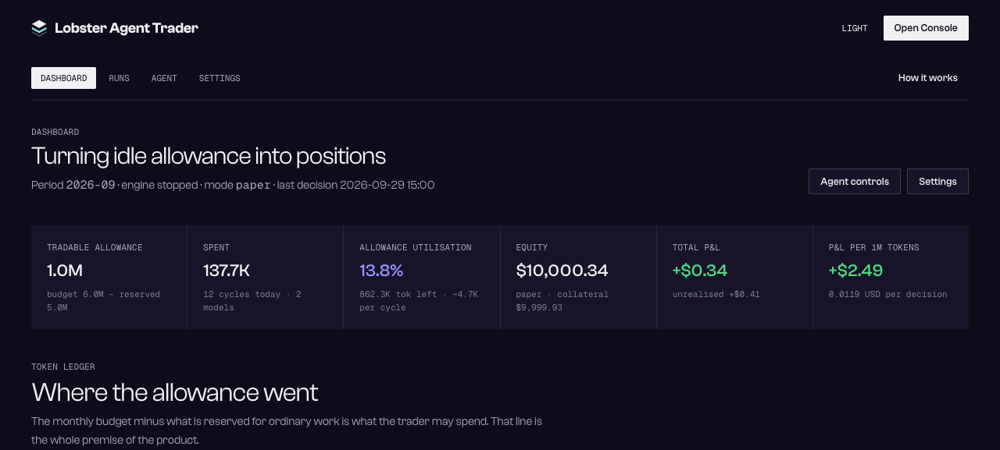
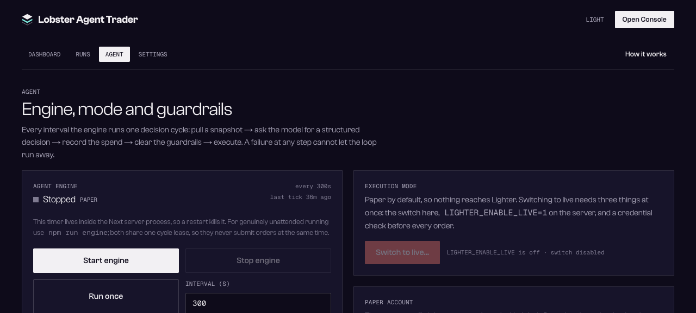

# Lobster Agent Trader

**Turn the AI tokens you never spend into positions that actually run.**

You already pay for a monthly AI token allowance. Whatever you don't spend on ordinary work
normally just expires — silently, invisibly, and in full. This project turns that remainder
into an explicit number the agent is allowed to burn, then puts it to work trading on
[Lighter](https://lighter.xyz).

You bring your own keys. Nothing is bundled, no credentials are stored in the database, and
the app binds to loopback by default.

```
allowance ledger → market snapshot → LLM decision → guardrails → order → ledger
```

> **Live demo:** <https://projectlobster.github.io/Lobster-Agent-Trader/>
>
> A static preview of the landing page. The console is not part of it — a static
> host cannot run a Node server, the Python agent kit, or a database, and
> hosting the console publicly would be unsafe regardless.

---

## Screenshots

**The landing page**



**The console — allowance, spend, and P&L in one strip**



**Every decision leaves a record — including the ones the guardrails stopped**



**Engine controls and the three locks that gate live trading**



**Dark theme**

| Dashboard | Agent |
|---|---|
|  |  |

<sub>Captured in paper mode against a local install, so the figures are sample data rather than a
live account.</sub>

---

## Quick start

```bash
npm install
npm run setup      # checks node/python, installs the agent kit, preloads the SDK, creates the paper account
cp .env.example .env.local
# add your model API key to .env.local
npm run dev        # prints the URL it actually bound to
```

Then open the console, paste your Lighter key under **Settings → Lighter**, and press
**Run once**. Read the run it produces before you let it loop.

> **The port is picked automatically, and 3000 is not the default.** If another Next project
> is already running on your machine, two processes can bind 3000 simultaneously (macOS allows
> this) and requests get distributed at random between them — the symptom is `/console`
> returning 404 while `/` opens a different app. `npm run dev` probes from 3210 upward for the
> first free port and prints it. To choose one yourself: `npm run dev -- -p 3000`.

`npm run seed` fills the console with sample decision records so it isn't empty on first run.

---

## Your keys

Both keys are yours. This project ships neither.

**Model API key** — enter it on the Settings page (stored in local SQLite; the API only ever
returns `apiKeySet: boolean`), or put it in `.env.local` (environment variables win).

**Lighter private key** — paste it into **Settings → Lighter → Exchange credentials**, or
write `~/.lighter/lighter-agent-kit/credentials` yourself (keep it `chmod 600`):

```
LIGHTER_API_PRIVATE_KEY=0x...
LIGHTER_ACCOUNT_INDEX=0
LIGHTER_API_KEY_INDEX=0
```

Create one at <https://app.lighter.xyz/apikeys> — or, for Robinhood Lighter, at
<https://robinhoodchain.lighter.xyz/apikeys>. The Settings form writes that same file and
sets its permissions: it never touches the database and never echoes the value back to the
browser. Leave the field empty to keep the stored key; use Clear to remove it.

> Everything works without a private key — market data and paper trading included. Only live
> orders need one.

### Deployments

All four are selectable under **Settings → Lighter agent kit → Deployment**, or pinned with
`LIGHTER_HOST`:

| Deployment | URL |
|---|---|
| Lighter mainnet | `https://mainnet.zklighter.elliot.ai` |
| Lighter testnet | `https://testnet.zklighter.elliot.ai` |
| Robinhood Lighter | `https://api.rh.lighter.xyz` |
| Robinhood Lighter testnet | `https://api.rh-testnet.lighter.xyz` |

**Credentials are per-deployment.** Account indices and API keys are issued for a specific
network, so switching deployments means switching your credential bundle as a whole. Caches are
keyed per host and the response cache is cleared on a deployment change, so a stale symbol map
cannot survive the switch.

---

## Exposing it to a network

The server binds `127.0.0.1` by default, so nothing is reachable from elsewhere. To reach it
from another machine:

```bash
# 1. Set an access password (strongly recommended)
export LIGHTER_TRADER_PASSWORD='use your own long password here'

# 2. Listen on every interface
npm run dev -- -H 0.0.0.0
```

**Those two steps are not enough on their own.** Basic auth over cleartext HTTP is not
encryption — the password can be sniffed by anything on the same network segment. To expose
this properly, put nginx or caddy in front to terminate TLS, so the browser only ever speaks
https and the proxy forwards to 127.0.0.1:3210.

If you just want to look at it from another machine, an SSH tunnel is simpler:

```bash
ssh -L 3210:127.0.0.1:3210 user@host
```

---

## Models and providers

All three providers are supported. OpenRouter is the easiest starting point — many models are
free there.

| Provider | Environment variable | Notes |
|---|---|---|
| `openrouter` (default) | `LIGHTER_TRADER_OPENROUTER_API_KEY` | OpenAI-compatible, many free models, and it **reports the authoritative cost of each call** — the ledger uses that instead of a local price table |
| `anthropic` | `LIGHTER_TRADER_ANTHROPIC_API_KEY` | Claude |
| `openai` | `LIGHTER_TRADER_OPENAI_API_KEY` | GPT / o series |

The model picker on the Settings page fetches OpenRouter's catalogue live and marks which
models are free; you can also type any model id. **Test model** sends one minimal request with
the current configuration and reports token counts and cost — much cheaper than running a full
decision cycle after every config change.

### Three real reasons a free model fails

1. **Account privacy settings.** Some free OpenRouter endpoints require you to allow training
   on your data. If that toggle is off, requests fail with
   `0 endpoints out of 1 requested are available matching your guardrail restrictions` (HTTP 404).
   This is an account setting, not a code bug — pick a different free model, or allow it in
   OpenRouter's privacy settings.
2. **Reasoning models spend the output budget on thinking.** Thinking tokens count as output
   tokens. Too small a budget yields `finish_reason=length` with an empty body. `maxOutputTokens`
   defaults to 8000 for headroom.
3. **`response_format: json_object` is not supported.** This free endpoint returns HTTP 400 for
   JSON mode, so `jsonMode` is **off by default**. The prompt already demands bare JSON, and zod
   validation plus up to 2 repair retries make the default path reliable enough.

### reasoning effort, measured

Four runs each against a real prompt on a free reasoning model
(`inclusionai/ling-3.0-flash-sante:free`):

| reasoning | avg tokens/cycle | output tokens | schema-valid | language compliance |
|---|---|---|---|---|
| `off` | 3,057 | ~280–460 | **3/4** | 1/3 |
| `low` (default) | ~5,750 | ~2,500–5,500 | **4/4** | 3/4 |

`off` saves nearly half the tokens but produces schema-invalid decisions (`symbol: null`).
**The default is `low`, reliability first.** Set `reasoningEffort` to `off` if you only care
about token cost, and leave `maxOutputTokens` generous.

Language compliance isn't 100%: free models occasionally write the `thesis` in English. Putting
the language requirement on the **last line of the user message** rather than only in the system
prompt raised it from 1/3 to 3/4 — not quite 4/4. The field is display-only and never affects
an order.

---

## The allowance model

```
tradable allowance = monthly token budget − reserved for real work + carry-over
```

- **Monthly token budget** — the total your model plan gives you each month.
- **Reserved for real work** — the part you are certain will go to non-trading tasks. The
  trader never touches it.
- **Carry-over** — when enabled, unspent tradable allowance rolls into the next period. Changing
  the monthly budget applies to the current period immediately; past periods stay frozen.

Every cycle's token spend (input + output, and cost) lands in the `llm_calls` table. When the
remaining allowance drops below the projected cost of one cycle, the engine writes a
`skipped / budget_exhausted` run and stops.

The projected **allowance** and the **daily cycle cap** are both checked *before* the model is
called, so hitting either stops the engine immediately — otherwise every interval would burn a
full cycle's tokens before finding out it wasn't allowed. (Cooldowns can't work this way: they
are per-symbol, and the model may pick a different symbol.)

The projection doesn't simply read `maxOutputTokens` — that would treat a hard ceiling as a
per-call constant and stop while plenty of budget remains. It uses the **average output of recent
calls**, and estimates input by character type: ~1 token per CJK character, ~4 characters per
token for Latin text.

> Funding rate is read from **Lighter's own** row, not Binance's. Cross-exchange rates don't even
> necessarily share a sign — in review, SOL was -0.0021% on Binance (shorts pay) and +0.0064% on
> Lighter (longs pay). Reading the wrong row inverts the carry signal handed to the model.

The console's headline metrics are **allowance utilisation** and **PnL per 1M tokens**.

---

## Architecture

| Layer | Location | Responsibility |
|---|---|---|
| Pages | `src/app/**` | Landing + Console (RSC reads the service layer directly, no HTTP hop) |
| API | `src/app/api/**` | Mutations and client polling only |
| Agent | `src/lib/agent/` | `snapshot` → `prompt` → `schema` → `guardrails` → `loop` → `engine` |
| LLM | `src/lib/llm/` | Anthropic / OpenAI / OpenRouter, usage normalisation + price table |
| Kit bridge | `src/lib/kit/` | Locate the kit, spawn python, parse JSON, error envelopes, TTL cache |
| Storage | `src/lib/store/` | `node:sqlite` (built into Node 22.5+), zero native dependencies |

**Why spawn instead of signing ourselves**: the kit already handles market metadata, precision
conversion, signing, broadcast, and error shaping. Reimplementing that only introduces risk in
precision and signing.

**A cycle's main cost is process count, not tokens.** Every kit call is a fresh Python process
plus several HTTPS round trips; a three-symbol cycle originally needed 13 spawns. Slow-moving
reads — market metadata, 24h stats, 8h funding, settled candles — go through a TTL cache that also
coalesces concurrent duplicate requests, which took `buildSnapshot` from 16.7s to 5.9s
(**64% faster**). Order books (which decide the fill price) and account state are **never**
cached. Changing the watchlist or the deployment actively clears the cache, otherwise a newly
added symbol would fail with "no market data" until the TTL expired.

Kit directory search order: `LIGHTER_AGENT_KIT_DIR` → `<repo>/.agents/skills/lighter-agent-kit`
→ `~/.agents/skills/...` → `~/.claude/skills/...`.

---

## What one decision cycle does

1. **Allowance gate** — a cheap pre-check; insufficient budget skips before any market call.
2. **Market snapshot** — order book and depth, candle series, funding rate, precision and
   minimum size for allow-listed symbols, compressed into compact text (token efficiency matters here).
3. **LLM decision** — strict JSON required: `action / symbol / side / size_usd / confidence /
   thesis / invalidation / horizon`.
4. **Bookkeep** — real usage into `llm_calls` and onto the run. The provider's reported cost is
   used when available, otherwise a local price table.
5. **Parse and validate** — zod; on failure the zod errors are fed back for a retry, **at most 2
   times**; a second failure is recorded as `error` with the provider's own diagnostic.
6. **Guardrails** — see below. A failure is recorded as `blocked` and **no order is placed**.
7. **Execute** — local code converts `size_usd` to a base amount (rounded down to market
   precision) and passes an argv array to `paper.py` / `trade.py`.
8. **Bookkeep again** — orders are recorded at their **actual fill** (filled size × fill price),
   not at the intended size. Zero fills are recorded as `blocked` with a reason and partial fills
   are recorded at the real quantity — otherwise the ledger fills with phantom orders that no
   position supports.
9. **Archive** — an equity snapshot is written.

The model only ever emits structured values and **never touches command-line arguments**, so
there is no path from prompt text to shell parameters.

---

## Guardrails

These run before an order is built and return per-rule reasons. A blocked decision is filed as a
`blocked` run rather than silently dropped.

| Guardrail | Default |
|---|---|
| Tradable symbol allow-list | BTC, ETH, SOL |
| Max notional per trade | $250 (oversized requests are clamped down, never scaled up) |
| Account leverage cap | 3× (the settings API hard-caps at 5×) |
| Max concurrent positions | 3 |
| Daily cycle cap | 48 (**checked before any tokens are spent**; hitting it stops the engine) |
| Minimum interval between orders | 300s (**per symbol** — a BTC cooldown does not block ETH) |
| Minimum confidence | 0.55 (lower suggestions are discarded, so the model is asked to return `hold`) |
| Daily loss limit | $20, and **tripping it stops the engine** |

Additional hardcoded constraints: spot pairs (anything containing `/`) are always rejected; paper
mode supports only `market` and `ioc`; live mode supports only `market`. An `ioc` without
`limit_price` is rejected — not theoretical, a free model really did produce
`order_type: "ioc"` with `limit_price: null` during testing.

---

## Security model: live takes three locks

Real orders cannot be reversed, so live trading requires three independent things:

1. Server environment variable `LIGHTER_ENABLE_LIVE=1`
2. The live switch in Settings (the API refuses to enable it without the first)
3. Typing `LIVE` to confirm when switching the Agent page to live

If any is missing, the engine refuses to start with an explicit reason. Starting live also runs
`auth status` first to confirm credentials are present.

**Credential handling** follows the kit's system: `LIGHTER_API_PRIVATE_KEY` lives only on the
machine you deploy to (an environment variable or `~/.lighter/lighter-agent-kit/credentials`,
ideally `chmod 600`). The Settings page can write that file for you and set its permissions, but
this project still never stores the key in the database and never returns it to the browser. A
model API key can live in `.env.local` or be entered in Settings and kept in local SQLite — the
API only ever returns `apiKeySet: boolean`. The `data/` directory holding it is `0700`, and the
database and its WAL/SHM siblings are `0600` (best effort — a filesystem that refuses chmod
keeps its default permissions).

**Keys never cross providers.** A key stored in Settings belongs to the provider selected at the
time. Probing a different provider without its own environment variable is refused with a reason
rather than sending one vendor's secret to another vendor's API. (This was a real bug found in
review; it's fixed and has regression tests.)

---

## Deployment model: single-user, self-hosted

**This project assumes exactly one user.** There is no account system, no sessions, no
multi-tenancy — all API routes share one `data/` directory and one Lighter private key. Don't
treat it as a service you can put on the public internet as-is.

Under that assumption, three defaults narrow the blast radius:

| Measure | Default behaviour |
|---|---|
| Bind address | `127.0.0.1`, reachable only from your machine (`npm run dev -- -H 0.0.0.0` to widen) |
| Access password | Unset = no authentication; set `LIGHTER_TRADER_PASSWORD` = pages and API require HTTP Basic Auth (static assets excepted) |
| Cross-site requests | Every write validates `Sec-Fetch-Site` / `Origin`; cross-site origins get 403, **regardless of whether a password is set** |

Not authenticating when no password is set is deliberate: on a single-user local setup it would
only get in the way. It also means that **the moment you widen the bind address without setting
a password, anyone can `curl` `/api/close-all` and flatten every position** — the endpoint only
requires a hardcoded string in the request body. `PUT /api/credentials` is the same grade of
operation: it can rewrite or delete your Lighter private key. The startup banner warns when you
bind a non-loopback address.

Even with a password set, basic auth travels in cleartext over plain HTTP. It stops accidents
and nosy neighbours, not a targeted attacker. Expose this properly and put a TLS-terminating
reverse proxy in front.

**Known gap:** the model API key in the database is stored in plaintext (`node:sqlite` has no
encryption). The `0700` on `data/` blocks other users on the same machine, not disk snapshots,
cloud backups, or container volumes. Put the key in `.env.local` instead, or swap in an
encrypted SQLite driver.

---

## Running the engine

Two paths, **sharing one cross-process cycle lease**, so they can never place orders at the same
time:

| Method | Use |
|---|---|
| Console's Start / Run once | Interactive debugging. The timer lives in the Next server process |
| `npm run engine` | **For unattended long runs** |

An in-process timer dies on restart or under a multi-worker setup. The console detects this: if
the engine claims to be running but no decision has appeared for more than 3 intervals, the
Agent page shows a red warning and suggests the CLI worker instead.

---

## Paper and live will diverge

Paper is a **local simulation** with structural limits, called out prominently in the console
whenever paper mode is active:

- Only taker fills; **maker orders never fill**
- No order-book impact: eating three levels in paper does not move the market
- No latency, no partial fills
- **No funding cost** — often the dominant P&L factor on a position held overnight
- Cross-margin only

So paper returns cannot be read as live expectations. Its purpose is to validate the decision
logic and the token spend, not to forecast returns.

---

## Configuration

Everything is configurable from the Settings page or directly in the database. **Environment
variables always win**, and fields pinned by one are labelled as such in the UI.

| Environment variable | Description |
|---|---|
| `LIGHTER_TRADER_LLM_PROVIDER` | `openrouter` \| `anthropic` \| `openai` |
| `LIGHTER_TRADER_LLM_MODEL` | Model id |
| `LIGHTER_TRADER_LLM_REASONING` | `off` \| `low` \| `medium` \| `high` |
| `LIGHTER_TRADER_OPENROUTER_API_KEY` / `_ANTHROPIC_` / `_OPENAI_` | Model API keys |
| `LIGHTER_TRADER_PASSWORD` | When set, all routes require HTTP Basic Auth; unset means no auth (safe only on loopback) |
| `LIGHTER_AGENT_KIT_DIR` | Explicit kit directory |
| `LIGHTER_TRADER_PYTHON` | Python interpreter, default `python3` |
| `LIGHTER_TRADER_KIT_TIMEOUT_MS` | Per-call kit timeout, default 180000 |
| `LIGHTER_TRADER_KIT_CACHE_MS` | Override the TTL for all kit read caches; `0` disables them entirely (for debugging) |
| `LIGHTER_TRADER_DB` | SQLite path, default `./data/lighter-trader.db` |
| `LIGHTER_HOST` | Lighter deployment (mainnet / testnet / Robinhood) |
| `LIGHTER_ENABLE_LIVE` | Must be exactly `1` to allow live |
| `LIGHTER_API_PRIVATE_KEY` etc. | Required for private reads and real orders |

Runtime data lives in `data/` (gitignored): `lighter-trader.db` and the paper account state
`paper-state.json`. The paper state is deliberately kept separate from the kit's default path so
this project's track record keeps its own books; clear `Paper state path` in Settings to use the
kit's default instead.

---

## Scripts

```bash
npm run setup      # environment check + install kit + preload SDK + init paper account + create db
npm run seed       # sample data (only applies when runs is empty)
npm run dev        # pick a free port automatically (prints the address it bound to)
npm run engine -- --once                 # run one decision cycle and exit
npm run engine -- --interval 300         # headless loop
npm test           # unit tests
npm run typecheck
npm run build
npm run build:demo # static landing page for GitHub Pages → out/
```

`npm test` runs two layers:

- **Pure functions** — every guardrail rule, decision schema parsing and repair, kit output
  parsing, allowance periods and carry-over, price conversion, config linting, `.env.local`
  parsing (Next loads it for web pages, but the tsx scripts under `scripts/` must load it
  themselves or `npm run engine` reads no configuration at all), the credential file's
  read/merge/atomic-write behaviour, cross-provider key isolation, the access guard's basic-auth
  and CSRF decisions, funding-rate source selection, and the equity window.
- **Decision loop** — `tests/agent-loop.test.ts` runs the full `tick()` against a **fake kit**
  (`tests/helpers/fake-kit.ts`: a temp directory plus a stub python script replaying fixed JSON),
  covering a successful open, a guardrail block, a zero fill, a repair after a parse failure,
  budget exhaustion, an LLM error, and "a cycle stopped mid-flight must not release the
  cross-process lease".

Two further deliberate regression tests: `text-canvas` and `text-body-xs` must coexist (Tailwind v4
puts font size and colour in the same `text-*` namespace, and tailwind-merge once dropped the
colour, turning the primary button into dark-on-dark), and `listEquity` must return the **newest**
n rows rather than the oldest n.

---

## API

| Route | Method | Purpose |
|---|---|---|
| `/api/kit` | GET | Kit location + health + auth status |
| `/api/account` | GET | Account and positions (paper or live) |
| `/api/runs` | GET | Decision list; `?id=` fetches one detail plus its LLM calls |
| `/api/decide` | POST | Run one decision cycle; returns 409 if a cycle is already running |
| `/api/engine` | GET/POST | Engine status / start / stop |
| `/api/ledger` | GET | Allowance ledger and spend detail |
| `/api/settings` | GET/PUT | Read/write config; GET returns config checks and which fields the environment pins |
| `/api/credentials` | GET/PUT/DELETE | Write / inspect / clear the Lighter private key (reports only whether one is set, never the value) |
| `/api/models` | GET | OpenRouter model catalogue, free models marked |
| `/api/models/test` | POST | One minimal request to verify connectivity with the current config |
| `/api/paper` | GET/POST | Paper account status / init / reset |
| `/api/close-all` | POST | `close_all` preview and execution (requires a confirmation string) |

---

## Fonts and visuals

The display face is **Clash Grotesk**, loaded from Fontshare's official CDN. Fontshare's licence
covers use in a site but not redistributing the font files, so the woff2 is deliberately not
vendored here. **Space Grotesk** is self-hosted as the fallback, so the design still holds
offline or if the CDN line is removed. The monospace face is Geist Mono (self-hosted).

Design tokens live in `src/app/globals.css`, exposed to Tailwind through `@theme inline`, with
light and dark driven by `[data-theme]`. First visit follows the system preference; once you make
an explicit choice, that wins.

---

## Reference

- Lighter Agent Kit: <https://github.com/elliottech/lighter-agent-kit>
- Lighter: <https://lighter.xyz> · API keys: <https://app.lighter.xyz/apikeys>
- OpenRouter: <https://openrouter.ai>

---

*Lobster Agent Trader is experimental software. Submitted orders and withdrawals **cannot be
reversed**. The regulatory status of crypto trading varies by jurisdiction — check your own.
Prove a strategy on testnet first, and only trade what you can afford to lose.*
